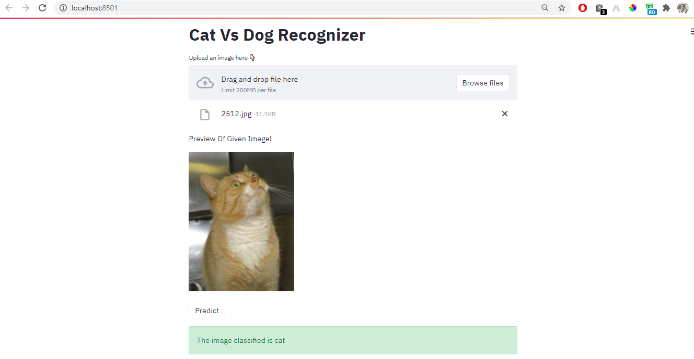

# Welcome to Streamlit :wave:


**The fastest way to build and share data apps.**

Streamlit lets you turn data scripts into sharable web apps in minutes, not weeks. It's all Python, open-source, and free! And once you've created an app you can use our [free sharing platform](https://streamlit.io/sharing) to deploy, manage, and share your app with the world.

# Usage

- Install dependencies
    ```txt
    pip install streamlit
    ```
- Run the app on your local machine
    ```bash
    streamlit run app.py

- Here I am upload all basic of Streamlit and also doing two projects(Car_Price_Prediction And CatvsDog_Prediction)

### Car_Price_Prediction


### CatvsDog_Prediction

